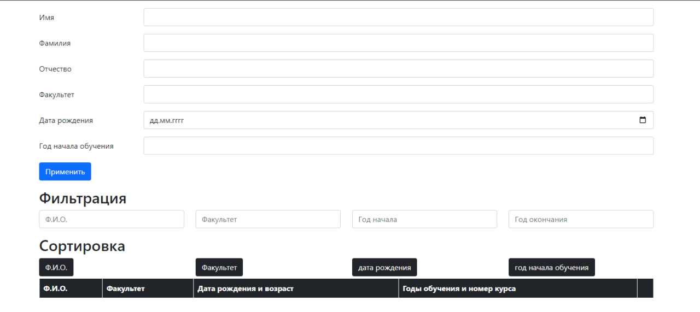

# List student

## description
A project with work on a server that uses asynchronous functions, validation, and filtering. To start the server, you need to open the folder with the backend part and register node _ in the terminal , now the server is running and all data is sent to it
